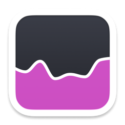
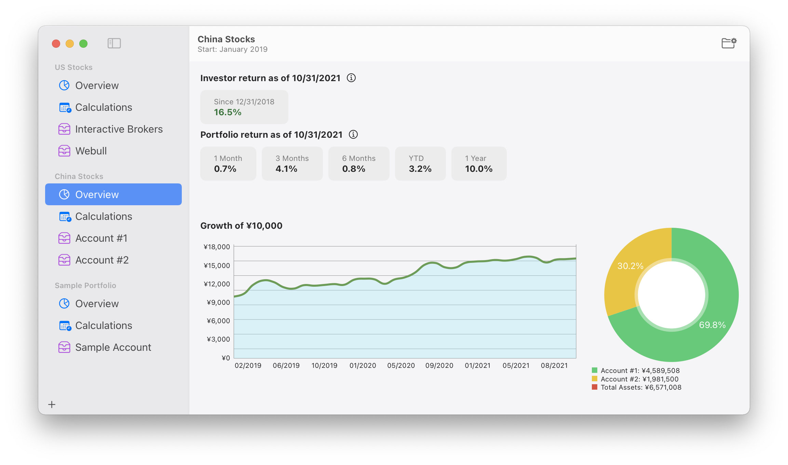

# Portfolio Returns 

Portfolio Returns is a financial app for macOS that helps you track your multiple investment or portfolios in one place.

It's inspired by [return spreadsheet](https://www.bogleheads.org/forum/viewtopic.php?f=10&t=150025) built by [Bogleheads forum](https://www.bogleheads.org/forum/index.php) member longinvest.
To learn more about how it computes returns, see Bogleheads wiki page [Calculating personal returns](https://www.bogleheads.org/wiki/Calculating_personal_returns).

## Features

* Track your multiple investment or portfolios in one place.
* Compute **investor return** (money-weighted return, internal rate of return).
* Compute **portfolio return** (time-weighted return, comparable return).
* Show portfolio returns for 1 month, 3 months, 6 months, year-to-date (YTD) and 1 year.
* Show portfolio returns for 3 years and up to 50 years.
* Calculate and show **growth of $10,000** chart.

## Usage

1. Create a portfolio.
1. Add one or more accounts.
1. At the close of the last day of each month, add **total contributions**, **total withdrawals** and **account balance** to each account.
1. Sleep well. Do not watch your portfolio. Let it perform.

## System Requirements

Portfolio Returns is developed and built with SwiftUI.
To use this app, be sure your Mac is running macOS 11 Big Sur or later.

## License

Portfolio Returns is available under the MIT license. See the [LICENSE](LICENSE) file for more info.

