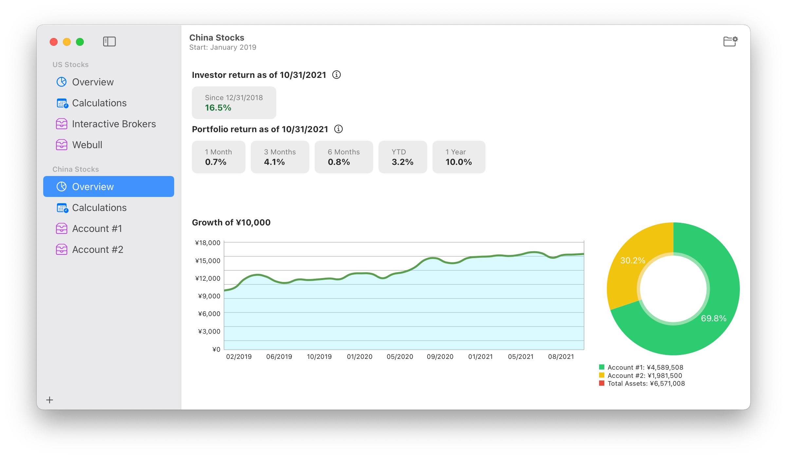

# Portfolio Returns 

Financial app for macOS inspired by [A Returns Spreadsheet for Bogleheads](https://www.bogleheads.org/forum/viewtopic.php?f=10&t=150025).
Learn more about [Calculating personal returns](https://www.bogleheads.org/wiki/Calculating_personal_returns).

## Features

* Track your multiple investment or portfolios in one place.
* Compute **investor return** (money-weighted return, internal rate of return).
* Compute **portfolio return** (time-weighted return, comparable return).
* Show portfolio returns for 1 month, 3 months, 6 months, year-to-date (YTD) and 1 year.
* Show portfolio returns for 3 years and up to 50 years.
* Calculate and show **growth of $10,000** chart.

## System Requirements

Portfolio Returns is developed and built with SwiftUI.
To use this app, be sure your Mac is running macOS 11 Big Sur or later.

## License

Portfolio Returns is available under the MIT license. See the [LICENSE](LICENSE) file for more info.

